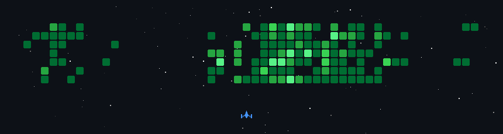

  

  [ <a href="#🇧🇷-português">Português</a> ] | [ <a href="#🇺🇸-english">English</a> ]

---

## 🇧🇷 Português

👋 Olá! Eu sou o **Andrew Souza**.

Sou um desenvolvedor **Fullstack** com forte foco em **arquitetura de backend moderno**, criando aplicações robustas, escaláveis e com código limpo e de fácil manutenção.

Trabalho principalmente com o ecossistema **TypeScript (Node.js)**, sou apaixonado por **open source** e busco construir soluções que resolvam problemas reais com alta performance.

### 🔎 Atualmente:
-   🛠️ Desenvolvendo o **[Nestsync](https://github.com/drewnetic/nestsync)**, uma ferramenta open-source para geração automatizada de SDKs type-safe.
-   🏗️ Construindo o **TraceNDT**, uma plataforma SaaS focada no setor industrial.

### 🏆 Projetos em Destaque

| Projeto | Descrição | Stack |
| :--- | :--- | :--- |
| **🔧 Nestsync** | Um gerador de SDKs *end-to-end type-safe* para projetos NestJS, focado em DX. | TS, NestJS, Node.js |
| **🏗️ TraceNDT** | Plataforma SaaS complexa para gerenciamento de inspeções industriais. | Fastify, Prisma, SQL |

---

### 🛠️ Tecnologias e Ferramentas (Core Stack)

  

**Outras Tecnologias:** React, HTML5, CSS3, REST APIs, Microservices.

### 🌐 Conecte-se comigo

  
  

---

## 🇺🇸 English

👋 Hi! I'm **Andrew Souza**.

I'm a **Fullstack Developer** deeply focused on **modern backend architecture**, building robust, well-structured, clean, and highly maintainable applications.

I mainly work with the **TypeScript (Node.js)** ecosystem. I'm passionate about **open source** and enjoy building solutions that solve real-world problems with high performance.

### 🔎 Currently:
-   🛠️ Developing **[Nestsync](https://github.com/drewnetic/nestsync)**, an open-source tool for automated, type-safe SDK generation.
-   🏗️ Building **TraceNDT**, a SaaS platform focused on the industrial sector.

### 🏆 Featured Projects

| Project | Description | Stack |
| :--- | :--- | :--- |
| **🔧 Nestsync** | An *end-to-end type-safe* SDK generator for NestJS projects, focused on DX. | TS, NestJS, Node.js |
| **🏗️ TraceNDT** | Complex SaaS platform for industrial inspection management. | Fastify, Prisma, SQL |

---

### 🛠️ Technologies and Tools (Core Stack)

  

**Other Technologies:** React, HTML5, CSS3, REST APIs, Microservices.

### 🌐 Connect with me

  
  

---

<h2 align="center">📊 GitHub Stats & Activity</h2>

  
  
  
   

  <i>Let's build something amazing together.</i>

